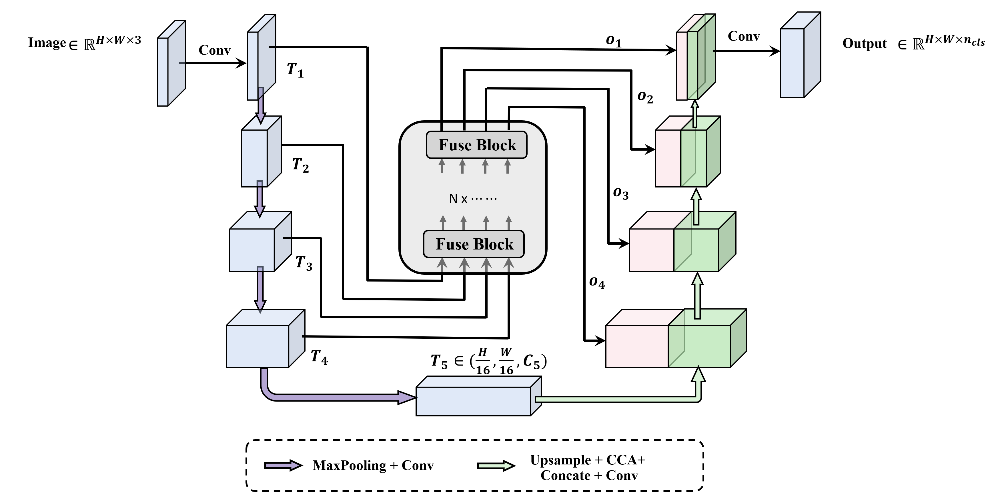
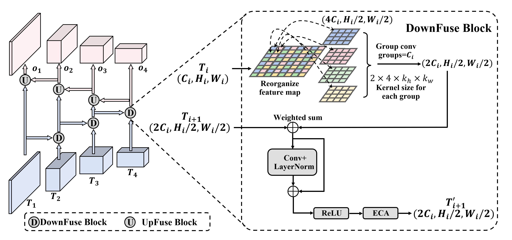

## FusionUNet

### 1. Overview
This is a brief guide for training and testing the code for FusionUNet. The paper is available at https://arxiv.org/abs/2310.10951.



The model is implemented in the foder 'funet' and all training relevant settings could be found at Config.py including the dataset path, learining rate, and training policy etc. You could modify the setttings according to your application needs.
To train a model that fits your application, please set proper path of dataset or modify the code about dataset configurations accordingly.


### 2. Usage
Here we use MoNuSeg/Glas dataset as an example. After properly setting the dataset, you could easily train the model with the following command:
```shell
python train.py
```
Then you will find a new folder named 'results' created and all relevant information and trained model will be saved within that folder. After training, you could use the script:
```shell
python test.py
```
to test it on the previously divided test dataset. But remember to change the value of the 'test_session' in the Config.py to your corresponding value before testing(where the trained model weights is stored).